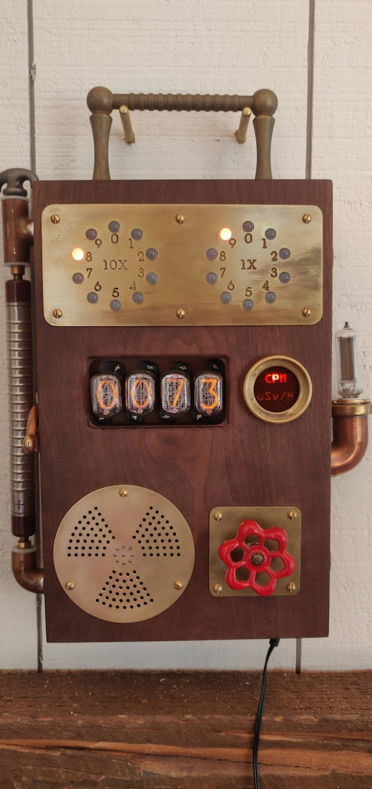

# ESP32Geiger

Geiger Counter

# Hardware

20x LED WS2811 string for Dekatron style LED display

4x Nixie tube IN12B

4x exixe: Miniture Nixie Tube Driver Modules https://www.tindie.com/products/dekuNukem/exixe-miniture-nixie-tube-driver-modules/

1x 170v Nixie HV supply, NCH8200HV https://www.tindie.com/products/omnixie/nch8200hv-nixie-high-voltage-power-module/

1x ESP32 Wrover

1x 5V > 3.3V buck PSU

1x SBM-19 Geiger tube

1x Geiger tube bias supply, 400V PSU 10Mohm 

1x Speaker driver, PAM8403 2 Channel Stereo 3W Class D Audio Power Amplifier Module

# Outputs
MQTT to homeassistant every 10 seconds cpm, uSv/H, msV/y

Readings posted to Safecast.org every five minutes

